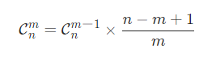

# 力扣刷题记录 
### 模拟 数学
## [119. 杨辉三角 II](https://leetcode-cn.com/problems/pascals-triangle-ii/)

#### 思路
和杨辉三角一样也可以直接模拟
也可以通过组合数公式来直接获得每一行的关系


#### 代码
##### 直接模拟
```java
class Solution {
    public List<Integer> getRow(int rowIndex) {
        rowIndex += 1;
        List<List<Integer>> res = new ArrayList<>();
        // 初始化第一行和第二行
        if(rowIndex >= 1){
            res.add(Arrays.asList(1));
        }
        if(rowIndex >= 2){
            res.add(Arrays.asList(1,1));
        }
        //计算剩下的每一行
        for(int i=2; i < rowIndex ; i++){
            List<Integer> pre = res.get(i-1);
            //加入第一个1
            List<Integer> cur = new ArrayList<>();
            cur.add(1);
            //将上一行的数字两两相加放入当前行
            for(int j=0; j<pre.size()-1; j++){
                cur.add(pre.get(j) + pre.get(j+1));
            }
            //加入最后一个1
            cur.add(1);

            res.add(cur);
        }
        return res.get(rowIndex-1);
    }
}
```
时间复杂度 O(rowIndex*rowIndex)
空间复杂度 O(rowIndex*rowIndex)

##### 使用数学推导后
java需要担心是否越界  python无需操心
```java
class Solution {
    public List<Integer> getRow(int rowIndex) {
        List<Integer> res = new ArrayList<>();
        res.add(1);
        for(int i = 1;i <= rowIndex;i++){
            // 特别要注意防止越界  两个数相乘可能超过int范围
            res.add( (int) ( (long) res.get(i-1) * (rowIndex - i + 1) / i));
        }
        return res;
    }
}
```
时间复杂度O(rowIndex)
空间复杂度O(rowIndex)

#### 推荐
[代码随想录刷题集](https://programmercarl.com/0062.%E4%B8%8D%E5%90%8C%E8%B7%AF%E5%BE%84.html#%E6%80%9D%E8%B7%AF)